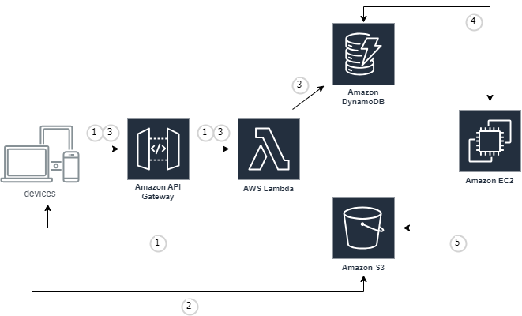
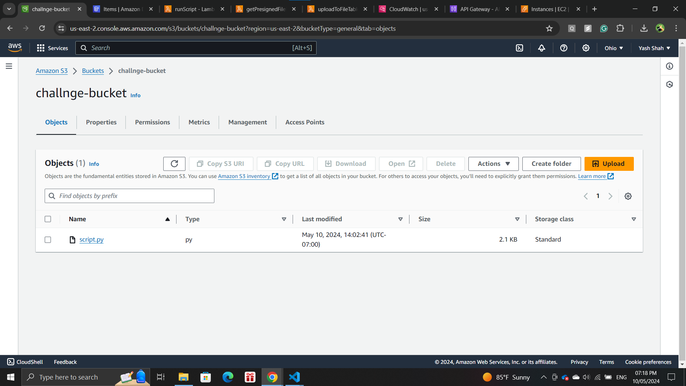
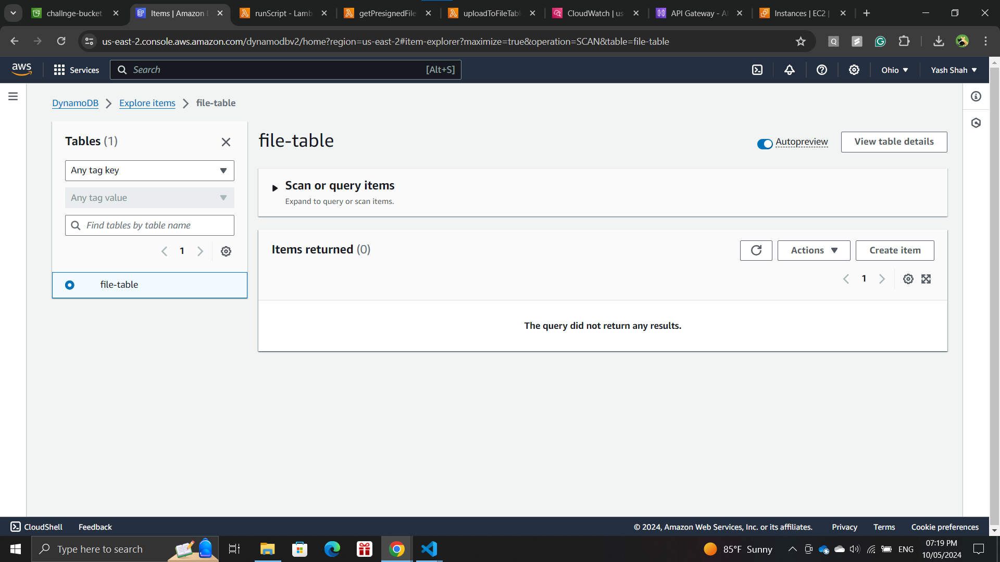
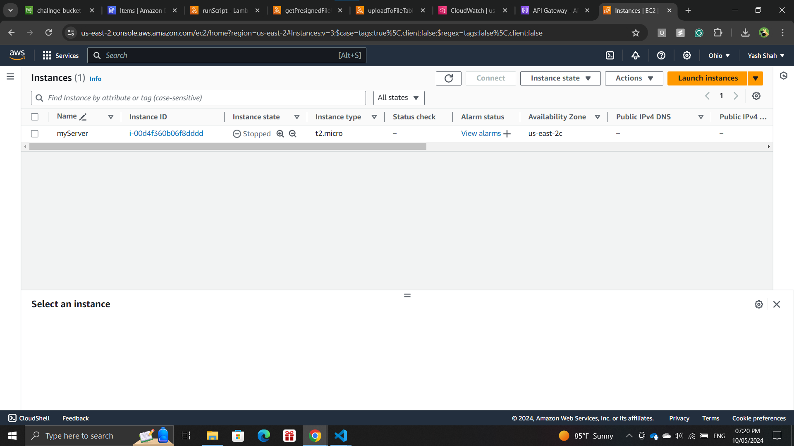
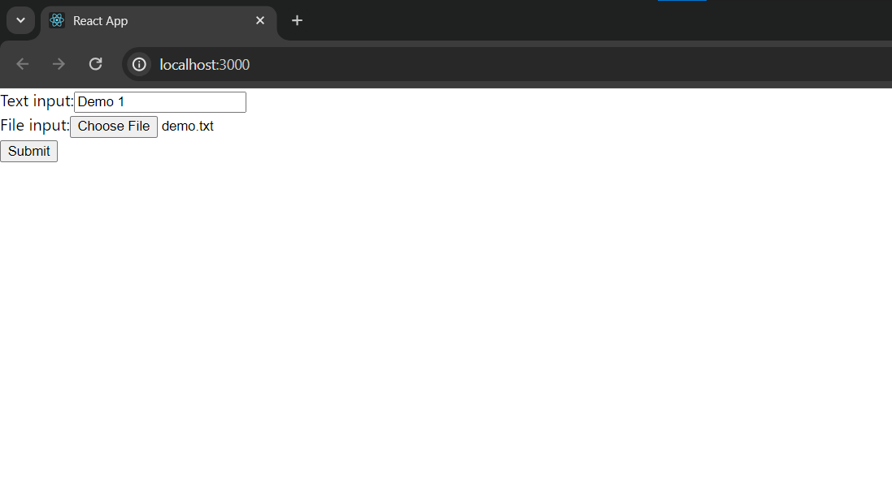
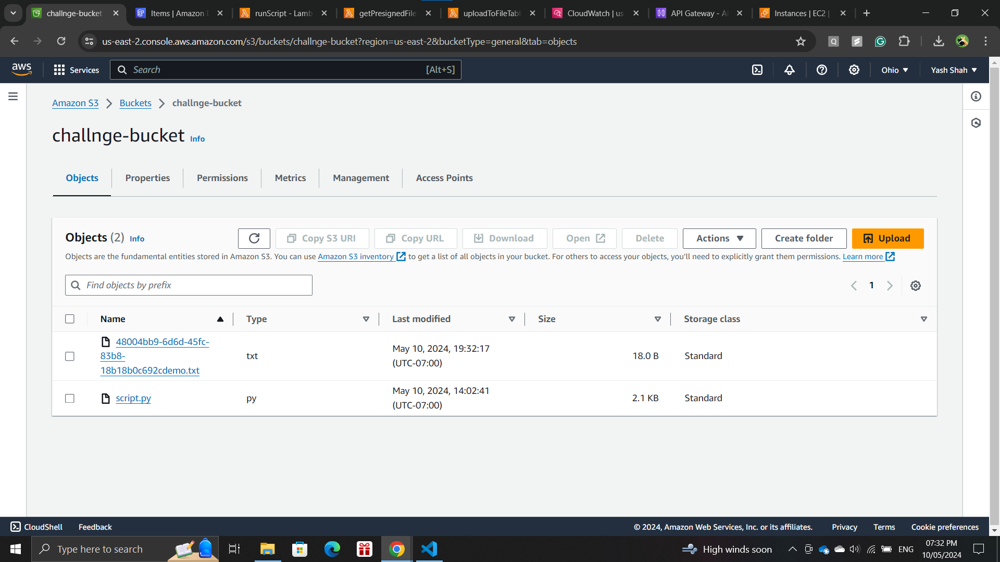
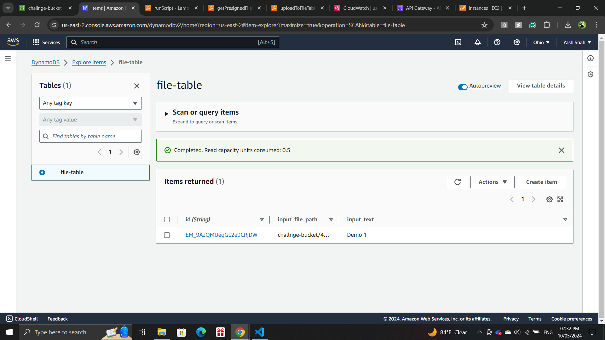
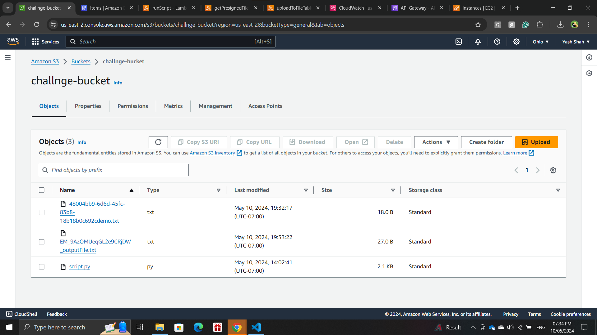
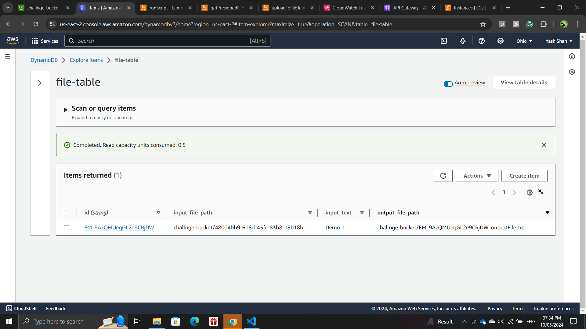
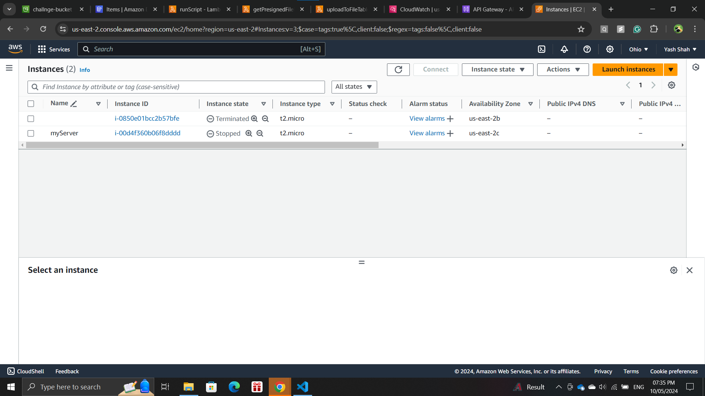

# Full-Stack Project

## Pre-requisites
- react 18.3.1
- axios 1.6.8
- uuid 9.0.1

## App Start
- git clone
```
git clone https://github.com/yash3108/full-stack-project.git
```

- Install dependencies
```
cd <project_name> 
npm install
```

- Build and run the project
```
npm start
```

## Design Decisions
- Made use of "uuid" in the input file name while uploading to S3 bucket. This helps overcome issue of overwriting file due to same file name.

- Made use of "nanoid" in the output file name while uploading to S3 bucket. This helps mark uniqueness of the output file and also resolves issue of overwriting of files due to same file name.

## Workflow



1. Device sends request for Presiged URL for S3 bucket object via API Gateway. Lambda function (getPresignedFileURL) generates the URL and sends it to the device.

2. Using the Presigned URL, file is uploaded to the S3 bucket.

3. All the device inputs are sent to Lambda function (uploadToFileTable) via API Gateway. This Lambda function inserts the input data in DynamoDB table.

4. This INSERT event triggers a Lambda function (runScript) creating an EC2 instance and executing script (script.py) obtained from S3 bucket.

5. This script processes the input text and file content from DynamoDB table and creates a new file and uplaods this output file into S3 bucket and terminates the instance.   

Note: All the Lambda functions were created and uploaded via zip file to the AWS console.\
Also created and assigned appropriate IAM roles for Lambda functions, EC2 instance, etc. 

## Tech Stack
- React
- AWS
    - S3
    - DynamoDB
    - Lambda
    - EC2
    - API Gateway

## Project Structure
The folder structure of this app is explained below:

| Name | Description |
|-------------------------------|----------------------------------------|
| **lambda_functions** | Contains code for all the AWS lamda functions                         |
| *lambda_functions/getPresignedFileURL* | Contains code for lambda function to get presigned URL |
| *lambda_functions/uploadToFileTable* | Contains code for lambda function to insert data into DynamoDB table |
| *lambda_functions/runScript* | Contains code for lambda function to launch VM (EC2) instance on DynamoDB event and run script |
| **public** | Contains the public page styling and images to be served |
| **src** | Contains code for React app |
| **Video**| Contains demo video of execution |
| package.json | Contains npm dependencies as well as build scripts  |
| script.py | Script to be run on EC2 instance

## Demo

**Note:** Video demonstration can be found in 'Video' folder.

### Screenshots
#### Before Execution:
- S3 Bucket


- DynamoDB Table


- EC2 Instances


#### During Execution:
- React App


- S3 Bucket


- DynamoDB Table


- EC2 Instances


#### After Execution:
- S3 Bucket


- DynamoDB Table


- EC2 Instances


## References
- https://www.pluralsight.com/resources/blog/guides/how-to-use-a-simple-form-submit-with-files-in-react
- https://aws.amazon.com/blogs/compute/uploading-to-amazon-s3-directly-from-a-web-or-mobile-application/
- https://boto3.amazonaws.com/v1/documentation/api/latest/reference/services/ec2/client/run_instances.html
- https://awscli.amazonaws.com/v2/documentation/api/latest/reference/s3/cp.html
- https://medium.com/@shanmorton/install-python-and-boto3-on-an-aws-ec2-instance-e8e40d92160f
- https://allardqjy.medium.com/using-pre-signed-urls-to-upload-files-to-amazon-s3-from-reactjs-5b15c94b66df
- https://medium.com/how-to-react/how-to-upload-files-on-an-s3-bucket-in-react-js-97a3ccd519d1
- https://www.youtube.com/watch?v=XEHvmxldc-E
- https://docs.aws.amazon.com/lambda/latest/dg/configuration-envvars.html#configuration-envvars-config